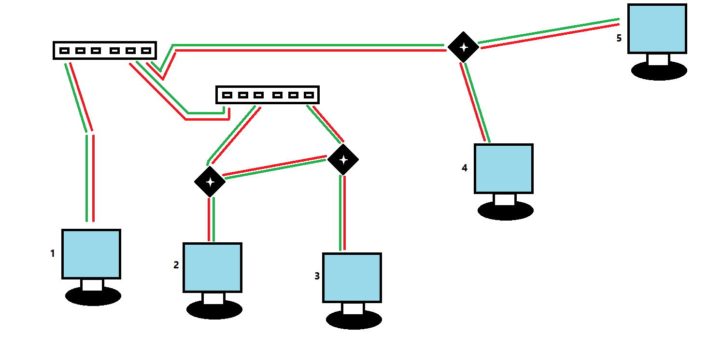

# 
Informe Proyecto Capa de Enlace

<h3>Equipo 15</h3>💬 Francisco Ayra Cáceres   💬 Lázaro Daniel González 

## Caracteristicas generales
- Seguiremos tratando el conjuntos de componentes anteriores en conexion como una misma componente conexa, y los Switches serian conexiones entre dichas componentes conexas
- En caso de estar conectados dos switches, no habrian componentes conexas de por medio.

**🔻 Los switches se comportan de la siguiente manera:**
- En cada turno recepcionan los envios de cada puerto.
- Ponen dichos envios en cola.
- Existe una cola asociada a cada puerto.
- En caso de recibir un frame, si el switch sabe a que puerto enviarlo(sabe donde esta ubicada la `MAC` de destino, se pondria dicho frame solo en la cola de dicho respectivo puerto).
- En caso de un **broadcast** o en caso de no conocer a que puerto asociar la `MAC` de destino, pues el frame se pondria en todas las colas de los puertos.

**🔻 Hay 4 formas de Transmision vs Resultado en una misma componente conexa: **
| | Dispositivos que transmiten| Resultado|
|--|-|-|
| 1 | 
**Un host**
| Todos los Dispositivos en esa misma CC reciben el frame intacto.|
| 2 | 
**Dos hosts**
 | Cada Dispositivo en esa CC recive XOR del frame excepto los dos hosts transmisores, reciben el frame del otro|
| 3 | 
**Un host y una señal externa de un switch**
 | Dicho host recibe la señal externa del switch, el switch recibe la señal interna del host, los demas dispositivos en la CC reciben un XOR del frame.|
| 4 | 
**Tres o mas frames al unisono**
 | Si se reciben 3 o mas señales al mismo tiempo, tanto de dispositivos internos, como de switches, cada dispositivo recibe un XOR de los valores de la transmision de los n - 1 otros dispositivos(sea n el numero de dispositivos transmitiendo en dicho CC + el numero de switches conectados a esta CC y transmitiendo).|

**🔻 Forma de tratar los datos en los switch**
En caso de haber colision en una CC, y esta este conectada a un switch, los datos estaran corruptos. El switch se encargara de detectar si el byte de verificacion esta correcto, y si esta bien, actuara como **repetidor** de este frame comportandose de la forma que se comento anteriormente.

**🔻 Cambios en el Protocolo**
Es sabido que en la capa fisica implementamos un protocolo para cada **host**, que se encargaba de detectar colisiones y en general era uno de los conocidos protocolos **ALOHA** con tiempo random de espera. Para detectar colisiones, cuando un dispositivo enviaba, se hallaba un XOR entre los valores que transmitian los dispositivos en una misma componente conexa, en cada componente conexa(CC); y luego, el metodo  Recive() se invocaba en cada dispositivo, pasandole como parametro el valor resultante de hacer XOR a los valores de los dispositivos  que estuviesen transmitiendo, de su componente conexa (incluyéndolo a él).
Pero en este caso, al tener el requerimiento de que un host pueda estar transmitiendo un bit y recibiendo otro sin que sea considerado una colision, no se hara XOR entre todos los Dervice's de una misma CC, se hara XOR entre los n-1 valores de los n-1 otros dispositivos que esten transmitiendo en esa misma CC. Por tanto, nos sera dificil simular este comportamento, al menos eficientemente, por lo que, para no obtener una complejidad muy significativa solamente para obtener que valor llegaria a cada host; donde, debemos almacenar que emite cada Host y usando tecnicas dinamicas podemos calcular rapido eso (formara parte entonces del protocolo de los dispositivos). Se sigue mantendiendo el protocolo implementado anteriormente para los Hosts, un ALOHA no persistente(no vuelve a enviar hasta que no este libre el canal) y con espera aleatoria de tiempo en caso de detectar una colision.

**🔻 Cosas a tener en cuenta en la ejecucion** 
Debido a la dificultad para simular el paso real de corriente por los cables y dispositivos, decidimos para una mejor simulacion, regular de la siguiente manera, como estara conformada una Componente Conexa cualquiera:
- No existira mas de un Hub en una misma CC. Esta regulacion se debe a lo anteriormente dicho y tambien a que 
